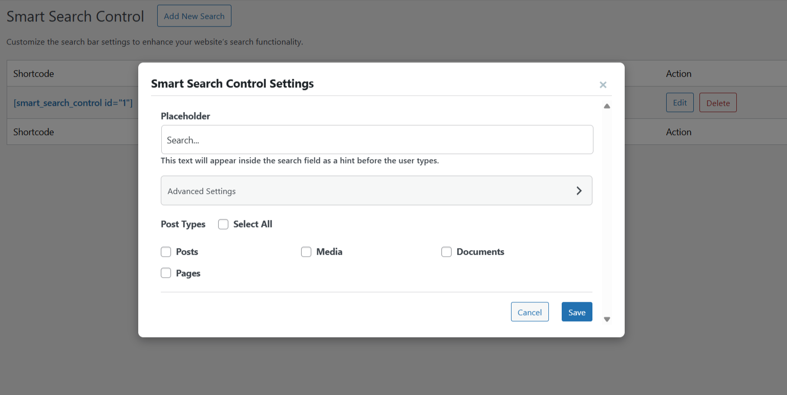
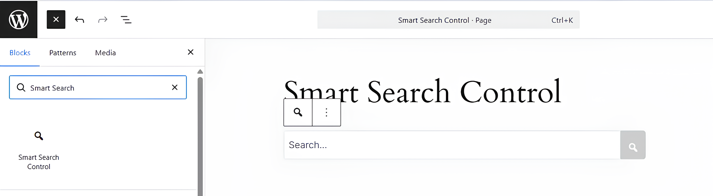
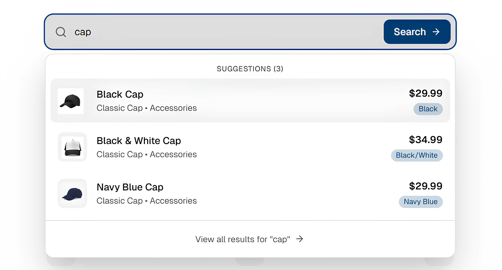
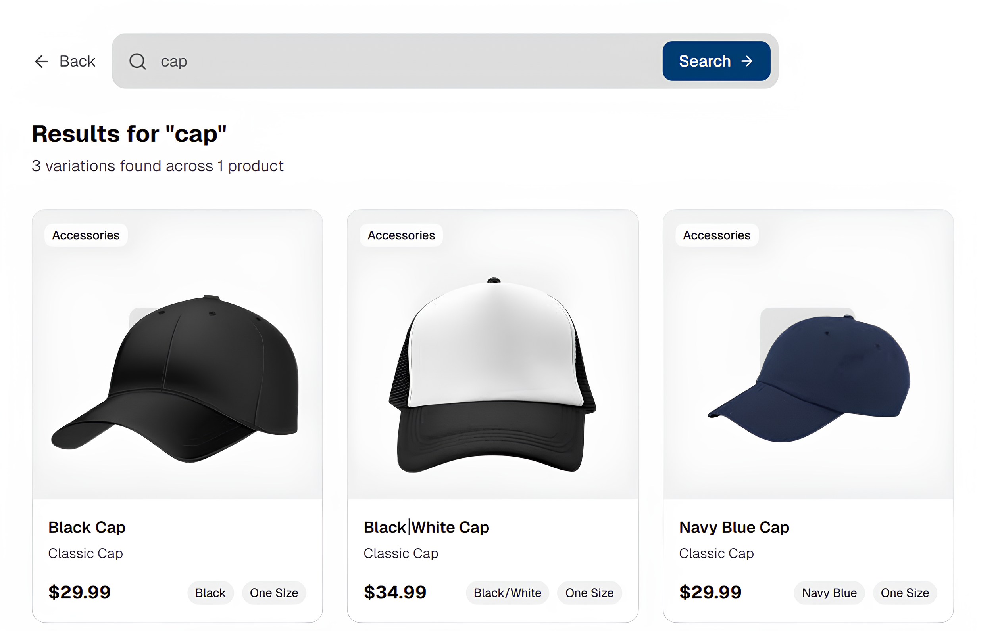

# Smart Search Control – Advanced Search for WooCommerce, Custom Post Types

Contributors: LDNinjas, farooqabdullah
Tags: search, woocommerce search, custom post types, product search, category search
Requires at least: 5.0
Tested up to: 7.0
Stable tag: 1.0.5
Requires PHP: 7.0
License: GPL-2.0-or-later
License URI: https://www.gnu.org/licenses/gpl-2.0.html

Advanced WordPress search with WooCommerce product search, category/tag & custom post type filtering, live suggestions, and a Gutenberg block.

## Description

**Upgrade your website’s search experience with Smart Search Control.**
As your website grows, so does the need for precision. Smart Search Control extends native WordPress capabilities to deliver accurate, highly relevant results for data-rich websites, WooCommerce stores, and Custom Post Types (CPT).
Whether you need a product search bar, a documentation filter, or a blog archive search, this plugin gives you full control. You can create unlimited search forms, place them anywhere using our Gutenberg Block or Shortcode, and ensure your visitors find exactly what they are looking for without frustration.

[youtube https://www.youtube.com/watch?v=8nKal2-a-4g]

## 🚀 Key Features

🔍 **Search in Custom Post Types:** Don't limit your users to just standard posts and pages. distinctively filter and search through any registered Custom Post Type (e.g., Portfolios, Events, Real Estate Listings).
🛒 **Advanced WooCommerce Search:** Fully compatible with WooCommerce. Allow customers to search Product Variations, SKUs, and Attributes to boost conversion rates.
🏷️ **Category & Tag Filtering:** Scope any search form to specific categories or tags per post type, so visitors only ever see the most relevant results — ideal for large blogs, multi-vendor shops, and content-heavy sites.
⚡ **Live Search Suggestions:** Offer a "Google-like" experience with real-time suggestions that appear as the user types.
🧱 **Gutenberg Block & Shortcode Support:** seamlessly add a search bar to any page, post, or widget area using our dedicated Gutenberg Block or the simple [smart_search_control] shortcode.
🎛️ **Multiple Search Instances:** Create unique search forms for different sections of your site (e.g., a "Blog Search" for your news section and a "Product Search" for your shop).
🎨 **Customizable Results Page:** Take control of your Search Results Page (SERP). Choose between Grid or List Layouts and assign a dedicated page for results, or let results display instantly on the same page when no results page is set.
🔧 **Developer Friendly:** extensive support for template overrides and hooks to fit your theme's branding perfectly.

## Why Choose Smart Search Control?
**1. Advance WooCommerce Search**
Standard search often misses hidden product data. Smart Search Control allows you to index and search WooCommerce Product Variations, ensuring customers find the exact size, color, or model they are looking for.

**2. Custom Post Type Filtering**
Building a directory or a portfolio? You can configure a search form to only look inside specific Post Types.
Example: Create a search bar that only searches "Movies" and ignores "Blog Posts."

**3. Category & Tag Search Filtering**
Need even more precision? Restrict a search form to specific categories or tags within a post type.
Example: A "Sale Search" bar that only searches products tagged "Clearance," or a blog search limited to the "Tutorials" category.

**4. Place It Anywhere**
We believe in flexibility.
**Gutenberg Ready:** Drag and drop the Search Block into your editor.
**Widget Support:** Add to sidebars or footers easily. (coming soon)
**Shortcode:** Use [smart_search_control id="123"] inside page builders like Elementor, Divi, or Beaver Builder.

## Installation & Usage
1. Install and Activate Smart Search Control.
2. Go to Smart Search Control > Add New Search.
3. Set your placeholder text (e.g., "Search for products...").
4. Select Post Types: Choose specific types (e.g., Products, Pages) or "Select All."
5. (Optional) Narrow it further by selecting specific Categories or Tags to search within.
6. Click Save and copy the generated Shortcode OR use the Gutenberg Block on any page.
7. (Optional) Go to Settings to define a custom Search Results Page — if skipped, results display on the same page.

## Support
For support, please visit our support forums or contact us through [our website](https://ldninjas.com).

## Frequently Asked Questions
**Q: Does this support WooCommerce Product Variations?**  
A: Yes! Smart Search Control is optimized to search through WooCommerce product variations, attributes, and custom fields to deliver the most relevant shopping results.

**Q: Can I use this with Elementor or Divi?**  
A: Absolutely. You can use the **[smart_search_control]** shortcode in any page builder text module.

**Q: Does it support Custom Post Types (CPT)?**  
A: Yes, the plugin automatically detects all public Custom Post Types registered on your site and allows you to include or exclude them from search results.

**Q: Can I limit search results to specific categories or tags?**  
A: Yes! Each search form (shortcode or Gutenberg block) can be scoped to specific categories and tags per post type, so visitors only see results from the sections of your site you choose.

**Q: Do search results have to open on a separate page?**  
A: No. If you don't select a dedicated Search Results Page in the settings, results display instantly on the same page, directly below the search bar.

## Changelog

- **1.0.5**
    - New: Added category and tag filtering support for search forms and the Gutenberg block, so results can be scoped to specific taxonomies per post type.
    - New: Search results now display instantly on the same page, directly below the search bar, when no dedicated Search Results Page is configured.
    - Improve: Hardened admin AJAX and settings handling with capability checks and nonce validation.
    - Improve: Aligned plugin naming and coding style with the project prefix conventions.
    - Improve: Added safer fallback handling for result-page and block rendering paths.
    - Improve: Polished templates and output escaping for better WordPress compatibility.

- **1.0.4**
    - New: Added Gutenberg block to add search anywhere.

- **1.0.3** 
    - New: Added admin notification if search result page is not selected. 
    - Fix: Fixed content override issue with search shortcode.
    - Fix: CSS Tweaks

- **1.0.2**  
    - New: Added option to display search results in list or grid view.
    - New: Implemented semantic UI for the results.
    - Fix: Fix pagination issues when no records are found.
    - Fix: Made the plugin compatible with WordPress 6.9
    - Fix: Made the plugin compatible with PHP 8.0

- **1.0.1**  
    - New: Remove php 5.4 support for stability
    - New: Added filter to update per page result counts.
    - New: Added filter to update count on search suggestions.
    - New: Added action hook to add new column to the admin table that displays all the created shortcodes.
    - New: Added action hook to add new fields to the search form.
    - New: Added action hook to add custom content to the settings page.
 
- **1.0.0**  
    - Initial release  

## Screenshots

### Custom Search Setup: Easily select which Post Types to search.  
  

### Gutenberg Block: Drag and drop the search form into your page.
  

### Live Suggestions: Real-time results appearing as the user types.
  

### WooCommerce Integration: Searching for a specific product variation.
 
