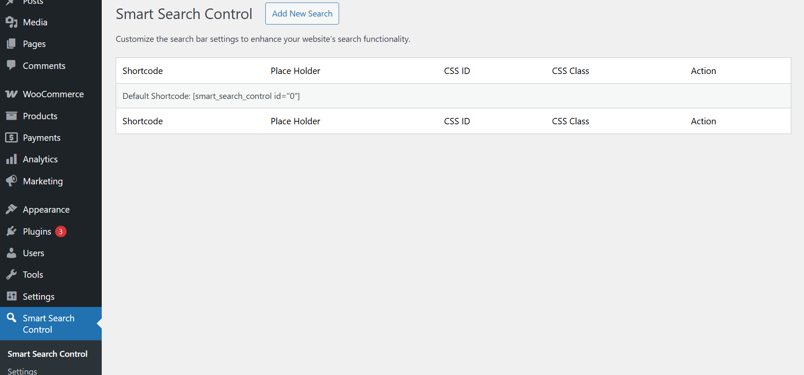
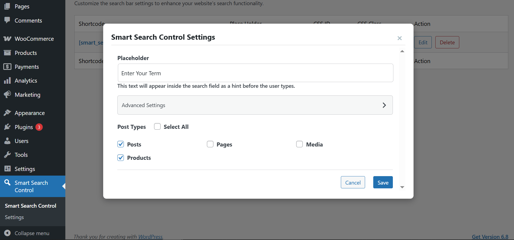
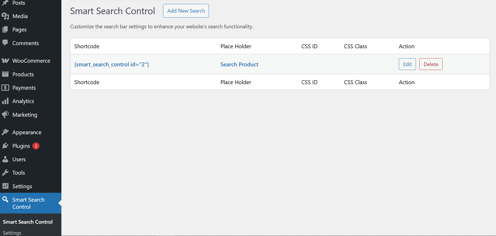
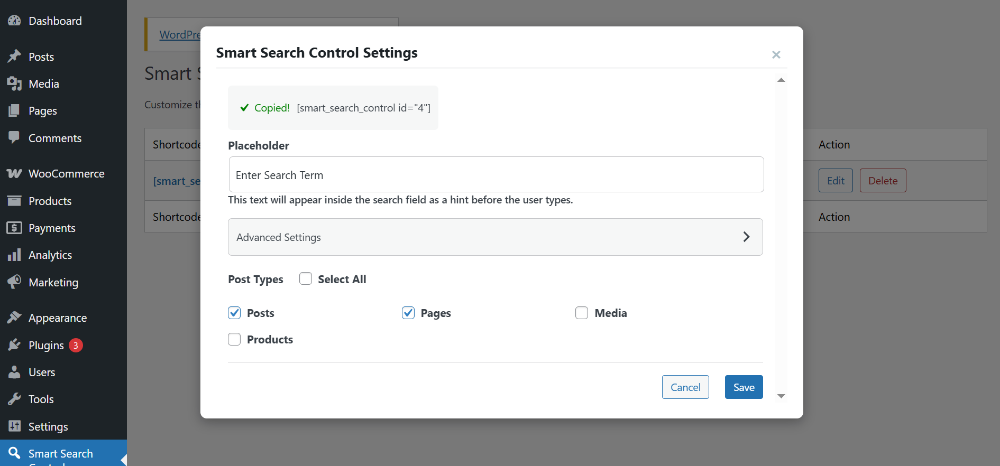
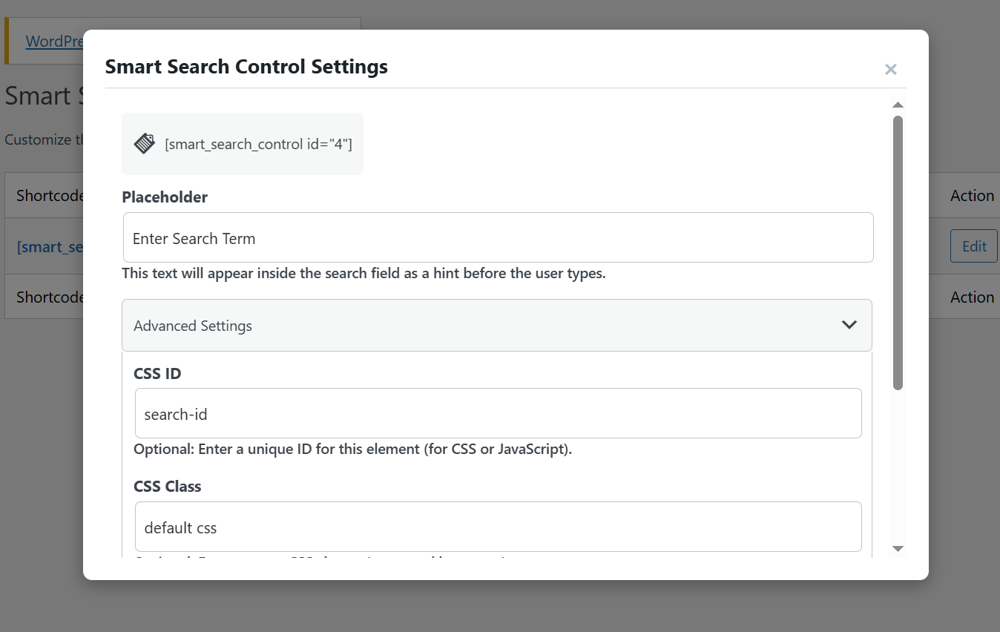
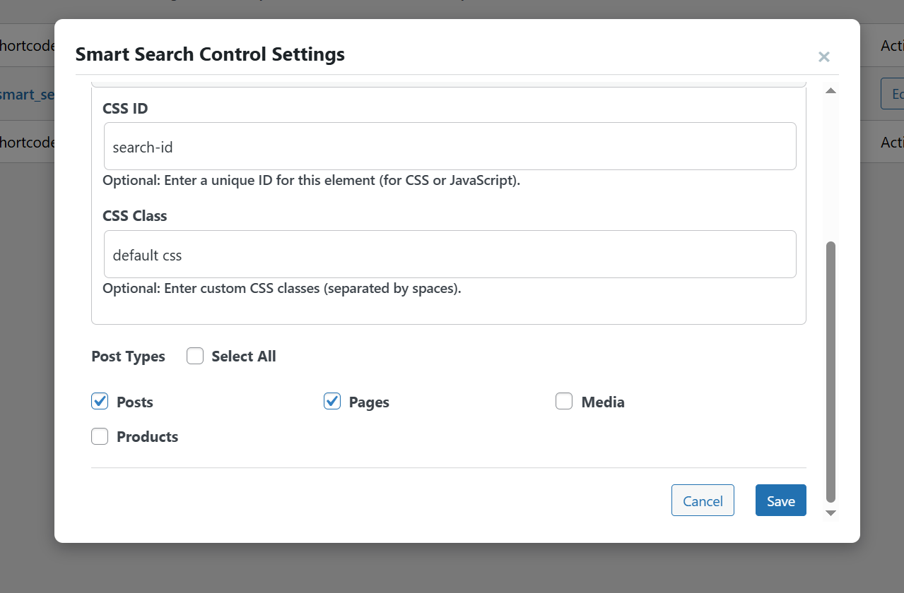
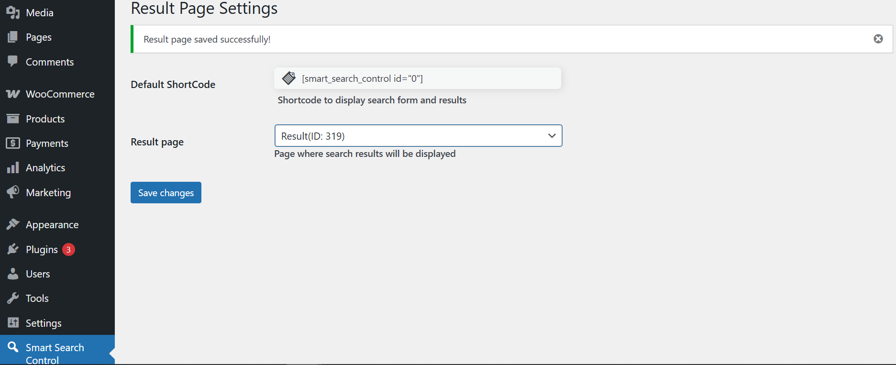
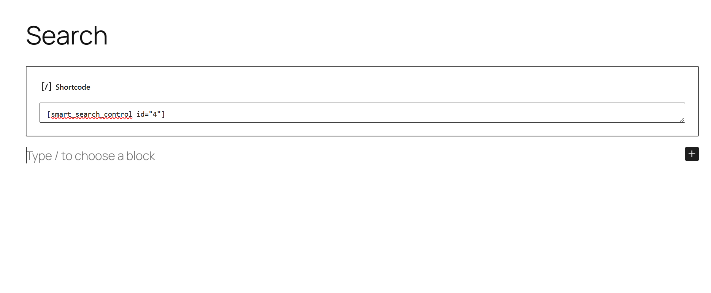
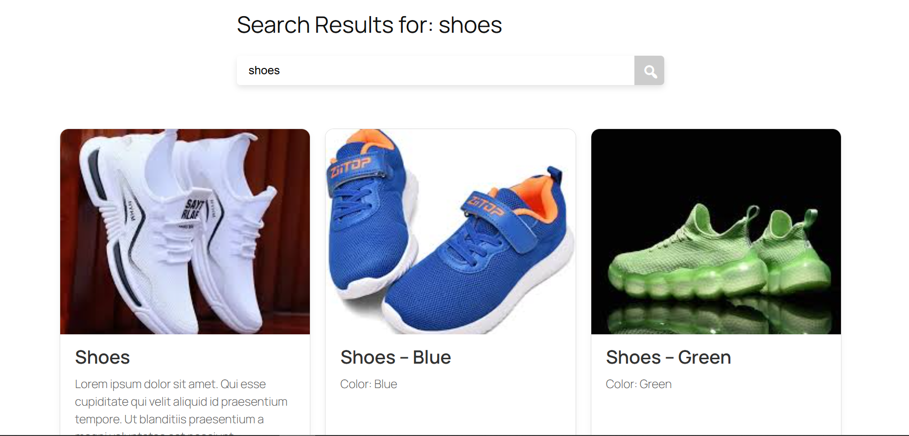

**WordPress Smart Search Control Plugin**

**Description**

Enhance the search functionality of your WordPress site with the Smart Search Control Plugin. This plugin replaces the default WordPress search with a more intelligent and efficient search engine, providing your users with accurate and relevant results.

**Key Features**

    <strong>Improved Accuracy: </strong> Delivers more relevant search results by analyzing content beyond titles and excerpts.
    <strong>Customizable Search Algorithm:</strong> Fine-tune the search algorithm to prioritize specific content types or fields.
    <strong>Live Search Suggestions:</strong> Provides real-time search suggestions as users type, improving the search experience.
    <strong>Custom Fields Support:</strong> Indexes and searches within custom fields created by plugins like Advanced Custom Fields (ACF).
    <strong>WooCommerce Compatibility:</strong> Optimizes search for WooCommerce products, including product attributes and variations.
    <strong>Search Analytics:</strong> Track user search queries to gain insights into what your visitors are looking for.
    <strong>Easy Installation and Setup:</strong> Simple installation and configuration process.

**Installation**

    <strong>WordPress Plugin Repository:</strong>
        Go to your WordPress admin panel.
        Navigate to "Plugins" > "Add New".
        Search for "Smart Search Control".
        Click "Install Now" and then "Activate".
    <strong>Manual Installation:</strong>
        Download the plugin ZIP file.
        In your WordPress admin panel, go to "Plugins" > "Add New".
        Click "Upload Plugin" and select the ZIP file.
        Click "Install Now" and then "Activate".

**Configuration**

    Navigate to the plugin settings page in your WordPress admin panel.
    Configure the search settings according to your preferences, including:
        Selecting which content types to include in the search.
        Prioritizing specific fields or content.
        Enabling or disabling live search suggestions.
    Save your changes.

**Usage**

[smart_search_control class="custom-class"]

**Frequently Asked Questions**

    No, the plugin is designed to be efficient and optimized for performance.

**Is this plugin compatible with WooCommerce?**

    Yes, the plugin enhances search for WooCommerce products.

**Can I customize the search results page?**

    The plugin improves the search results, and you can further customize the appearance using your theme's templates.

**Does it support custom post types?**

    Yes, the plugin supports custom post types.

**Troubleshooting**

    If you encounter any issues, please refer to the plugin documentation or contact our support team.

**Support**

For support, please visit our support forums or contact us through our website.

**Changelog**

    <strong>1.0.0</strong>
        Initial release
    <strong>1.1.0</strong>
        Added WooCommerce compatibility.
    <strong>1.2.0</strong>
        Improved search accuracy.
    <strong>1.3.0</strong>
        Added support for custom fields.

**Screenshots**
    
    Admin settings page
        
        
        
        
        
        
        

    Search page
        
    Results page
        
